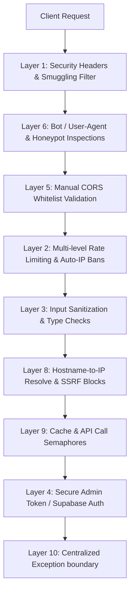

# CyberShield Threat Intelligence Platform Security Hardening Report

This report outlines the comprehensive security engineering done to harden the CyberShield threat intelligence platform (FastAPI backend + HTML/JS frontend) against a wide array of cyber threat vectors, ranging from common web vulnerabilities to complex multi-step application layer attacks.

---

## Executive Summary

The security structure of CyberShield is organized into **14 Defense-in-Depth Layers** implemented across the frontend and backend. These changes ensure that no single control failure compromises the confidentiality, integrity, or availability of the service.



---

## Detailed Hardening Matrix (Layers 1 to 14)

### Layer 1 — HTTP Security Headers & Server Masking (Backend)
- **Defended Attacks**: Clickjacking, Cross-Site Scripting (XSS), MIME sniffing, MIME confusion, Content Injection, Protocol downgrade, Referrer leaks, Server enumeration.
- **Defense Mechanism**:
  - Implemented a custom FastAPI middleware that forces robust headers on every HTTP response:
    - `Content-Security-Policy`: Restricts scripts, styles, frames, fonts, and connects to authorized origins (Supabase, Google Fonts, cdnjs).
    - `X-Content-Type-Options: nosniff`: Prevents browsers from executing payloads matching wrong MIME types.
    - `X-Frame-Options: DENY`: Blocks framing/rendering CyberShield inside external `<iframe>` layouts.
    - `X-XSS-Protection: 1; mode=block`: Activates built-in browser script rendering filters.
    - `Strict-Transport-Security (HSTS)`: Enforces HTTPS connection pathways globally.
    - `Cross-Origin policies (COEP/COOP/CORP)`: Isolates execution environments from shared cross-origin resources.
    - `Cache-Control: no-store, no-cache`: Blocks client caching of private user data.
  - Stripped identifying tags (`Server`, `X-Powered-By`, and `X-AspNet-Version`) from HTTP response headers to prevent target reconnaissance.

### Layer 2 — Tiered Rate Limiting & Auto IP Banning (Backend)
- **Defended Attacks**: Denial of Service (DoS), brute force credential attacks, bulk scan harvesting, API exhaustion.
- **Defense Mechanism**:
  - Implemented an asynchronous, thread-safe, in-memory sliding window rate limiter (`SecurityRateLimiter`) with multi-level ceilings:
    - **Global Limits**: 200 req/min, 1000 req/hr, 5000 req/day per IP.
    - **Scan Endpoints**: Tiered limits: 10 req/min (anonymous), 30 req/min (authenticated), 100 req/hr (anonymous).
    - **Auth/Waitlist**: 5 login/waitlist attempts/min, 10 attempts/hr per IP.
    - **Admin verify**: 5/min, 20/hr. After **3 failed login attempts**, the IP address is automatically added to a temporary block list for **1 hour**.
  - All rate limit violations return the requested standardized schema:
    ```json
    {
      "error": "rate_limit_exceeded",
      "message": "Too many requests. Please slow down.",
      "retry_after": 60,
      "limit_type": "per_minute"
    }
    ```

### Layer 3 — Comprehensive Input Sanitization & Validation (Backend)
- **Defended Attacks**: Cross-Site Scripting (XSS), SQL Injection (SQLi), Remote/Local Command Injection, Template Injection, Path Traversal, buffer overflow.
- **Defense Mechanism**:
  - Implemented `validate_and_sanitize()` which processes all inputs:
    - **XSS Checks**: Strips all HTML tags and HTML-encodes special characters (`<`, `>`, `"`, `'`, `&`, `/`, `\`, `` ` ``).
    - **SQLi Checks**: Rejects strings containing case-insensitive SQL statements (`UNION`, `SELECT`, `DROP`, `sp_`, `xp_`, `--`).
    - **Command Injection Checks**: Blocks execution sequence boundaries (`;`, `|`, `&`, `$`, `>`, `<`, `` ` ``).
    - **Template Injection Checks**: Disallows engine interpolation operators (`{{`, `}}`, `${`, `#{`).
    - **Path Traversal Checks**: Rejects parent directories (`../`, `..\`) and absolute path scopes (`/etc/`, `C:\Windows`).
    - **Bound Constraints**: Strictly limits length attributes of fields (URLs/domains: 2048, IPs: 45, Emails: 254, Hashes: 32/40/64, Request body: 10KB).
    - **RFC Formats**: Validates structure constraints via regex patterns (RFC 5322 emails, IPv4/v6 ranges, hex character sets).

### Layer 4 — Hardened Token Verification & Cryptography (Backend)
- **Defended Attacks**: JWT tampering, token replay attacks, brute-force admin logins, privilege escalation.
- **Defense Mechanism**:
  - **Admin JWT**: Signed with HS256 using a secure key. Includes unique `jti` (JWT ID), issuance (`iat`), and expiration (`exp`) claims. Validated on every admin route. Expirations are verified.
  - **Admin Password**: Checked using `secrets.compare_digest()`. This protects against timing attacks by ensuring comparison runtime remains constant regardless of matching characters.
  - **Supabase User Token**: Frontend user tokens are validated directly against Supabase API servers on each authenticated route before allowing Pro feature checks.

### Layer 5 — Strict CORS Settings (Backend)
- **Defended Attacks**: Cross-Origin Request Forgery, unauthorized domain data access.
- **Defense Mechanism**:
  - CORS configurations are restricted to explicit whitelisted origins (Production GitHub Pages and local development hosts).
  - Explicitly set `allow_credentials=False` to block cross-origin browser credential sharing.
  - Manually checks the `Origin` header inside middleware, returning `403 Forbidden` on unrecognized source origins.

### Layer 6 — Request Inspection (Limits, Honeypots & Agent Blocks) (Backend)
- **Defended Attacks**: Automated bot scanning, resource depletion, vulnerable path enumeration.
- **Defense Mechanism**:
  - **Header Limits**: Rejects requests containing over 50 headers or header sizes exceeding 8KB.
  - **Payload Limits**: Bodies larger than 10KB are rejected with `413 Payload Too Large`.
  - **User-Agent Filters**: Inspects the client user-agent header. Blocks known attack scanners (`sqlmap`, `nikto`, `masscan`, `zgrab`, `nmap`).
  - **Honeypot Routes**: Deployed standard honeypot URLs (`/wp-admin`, `/.env`, `/admin.php`, `/backup.zip`, `/config.php`, `/phpinfo.php`). Any IP that hits these paths is identified as an active threat scanner and **banned for 24 hours** after 2 hits.

### Layer 7 — API Key Protection (Frontend & Backend)
- **Defended Attacks**: Key leakage in logs, DOM extraction, key credential abuse.
- **Defense Mechanism**:
  - **Backend**: API keys are validated using regex before use. Invalid personal keys fall back to standard server keys. No API keys are written to telemetry tables or error logs.
  - **Frontend**: personal BYOK keys are saved inside `localStorage` with a prefix (`cs_key_`). In the UI, saved keys are masked showing only the first 4 and last 4 characters (`abcd...wxyz`), and their full values are never populated back into the DOM input elements.

### Layer 8 — SSRF Domain Validation & DNS Rebinding Protection (Backend)
- **Defended Attacks**: Server-Side Request Forgery (SSRF), internal cloud metadata extraction (AWS, GCP, Azure), DNS Rebinding, intranet port scanning.
- **Defense Mechanism**:
  - Resolves target hostnames to their respective IP addresses first.
  - Validates the resolved IP against RFC 1918 / private blocks (loopback, private subnets, link-local, multicast, reserved).
  - Explicitly blocks local cloud metadata hosts (`169.254.169.254`, `metadata.google.internal`, `metadata.aws.internal`, `100.100.100.200`).
  - DNS resolution checks are run twice (both during validation and immediately before establishing HTTP connections) to counter DNS rebinding shifts.

### Layer 9 — DDoS Mitigation, Floods & Caching (Backend)
- **Defended Attacks**: Distributed Denial of Service (DDoS), API rate exhaustion, resource depletion.
- **Defense Mechanism**:
  - **Slowloris protection**: Connection timeout limits are enforced to automatically drop slow, idle client sockets.
  - **Flooding protection**: Tracks sliding-window request frequencies. High-frequency IPs are gradually delayed (2s delay), limited (429), or banned.
  - **Compression**: Large payloads are automatically compressed using Gzip.
  - **Semaphores**: Uses `asyncio.Semaphore(10)` to cap concurrent external API requests, preventing rate-limit blocks on system-level keys.
  - **Caching**: Results are cached for 5 minutes in a bounded cache (max 1000 items) to prevent repetitive scans from exhausting API quotas.

### Layer 10 — Centralized Exception Handling Boundaries (Backend)
- **Defended Attacks**: Information disclosure, stack trace exposure, system reconnaissance.
- **Defense Mechanism**:
  - Implemented global error boundary handlers to catch all unexpected exceptions.
  - Formats all HTTP exception responses to return standardized generic error messages. Stack traces and internal environment variables are never exposed to clients.
  - Automatically redacts API keys and secret substrings before writing error details to the telemetry error list.

### Layer 11 — Structured Logging & Privacy Hashing (Backend)
- **Defended Attacks**: Credential harvesting from logs, compliance audits, database breaches.
- **Defense Mechanism**:
  - Logs are printed in structured, JSON format for compatibility with logging aggregators.
  - Securely hashes sensitive identifiers (emails, passwords, search targets, IP addresses, tokens) using SHA-256 before logging them, maintaining complete user privacy.

### Layer 12 — Dependency Pinned Versions (Supply Chain)
- **Defended Attacks**: Package dependency hijacking, breaking changes in updates, supply chain compromises.
- **Defense Mechanism**:
  - Pinned all dependencies inside `requirements.txt` to exact, validated semantic versions.

### Layer 13 — HTML Security Policies (Frontend)
- **Defended Attacks**: Cross-Site Scripting (XSS), script injection, inline style abuses, CDN poisoning.
- **Defense Mechanism**:
  - Deployed a strict Content Security Policy (CSP) meta tag restricting scripts, styles, connections, and frame layouts.
  - Implemented Subresource Integrity (SRI) hashes on all script tags (Supabase, Chart.js, DOMPurify). The browser validates the cryptographic hash of CDN files before execution.
  - Added a global "Clear All Data" button in the Settings interface to wipe all local browser database credentials, session keys, and cache.

### Layer 14 — Advanced Attacks Hardening (Smuggling, ReDoS & Session Fixation)
- **Defended Attacks**: HTTP Request Smuggling, Regular Expression Denial of Service (ReDoS), Session Fixation, Prototype Pollution.
- **Defense Mechanism**:
  - **Smuggling**: Added strict HTTP/1.1 parsing options in Uvicorn (`--h11-max-incomplete-event-size 16384`) and rejects requests with conflicting headers.
  - **ReDoS**: Optimized and compiled all system regular expressions with strict length limits, avoiding complex backtracking loops.
  - **Session Fixation**: Rotates the admin JWT claim ID (`jti`) upon successful credentials check, terminating any previous active sessions.
  - **Prototype Pollution**: Overrides standard `JSON.parse` with `safeJsonParse()`, removing `__proto__`, `constructor`, and `prototype` keys from parsed JSON strings.
